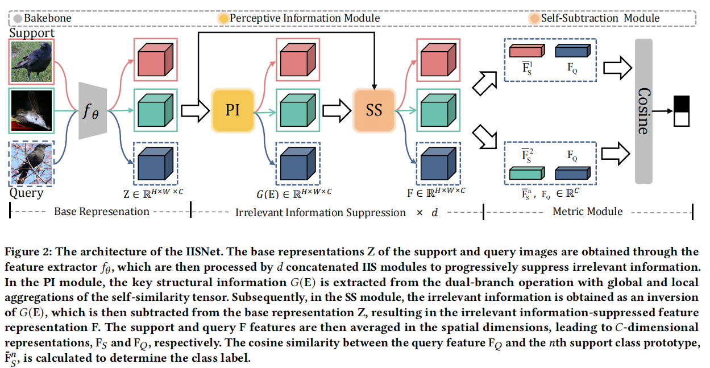
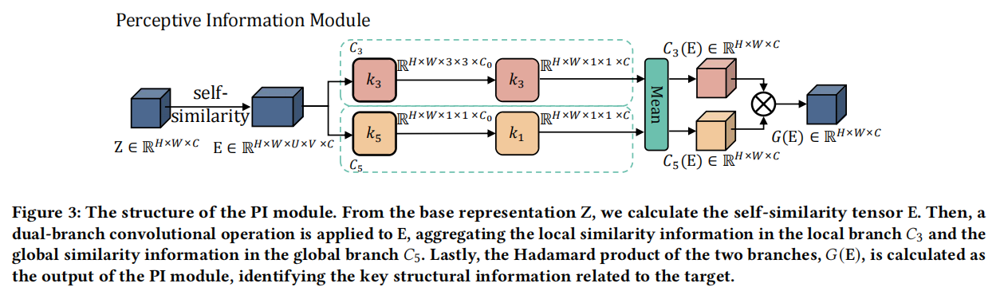
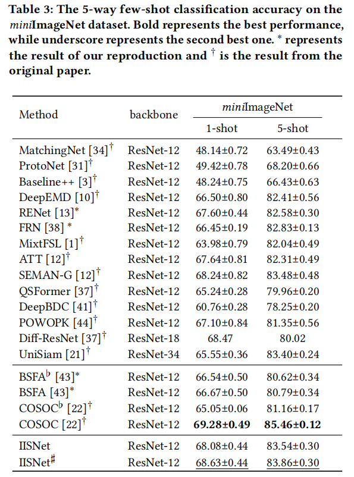

# IISNet
Irrelevant Information Suppression for Few-Shot Classification  
abstract:Deep neural networks have invigorated research of few-shot image classification. However, the interference of non-target information in feature representations hampers classification generalization. To tackle this issue, we propose an irrelevant information suppression (IIS) module, which is focused on suppressing the weight of unimportant information and augmenting the sparsity of feature representations. An IIS network with three consecutive IIS modules is developed, to illustrate the progressive suppression of unimportant information and highlight of key discriminative features of the target. Extensive experiments showcase the superior performance of our IIS network on four widely-used benchmark datasets. Furthermore, we show that the IIS module can be readily used as a plug-in module by state-of-the-art few-shot classifiers, and can clearly further improve their performance. 
  
  

# Change your dataset_dir
You need to cd /IISNet-main/common/utils.py ,to change the "-data_dir" to your dataset_dir.

# Training the code 
cd /IISNet-main/train/xxx.sh  
Please set the gpu id which you want to run,then run the file such as "bash aircraft_5w1s.sh". 

# Testing the code 
cd /IISNet-main/test/xxx.sh  
Please set the gpu id which you want to run,then run the file such as "bash cars_5w5s.sh".

# Acknowledgements
Our code is based on RENet repository. We thank the authors for releasing their code. If you use our model and code, please consider citing these works as well.

# result on Aircraft、Cars and Cub_crop
  

# result on miniImageNet
  
